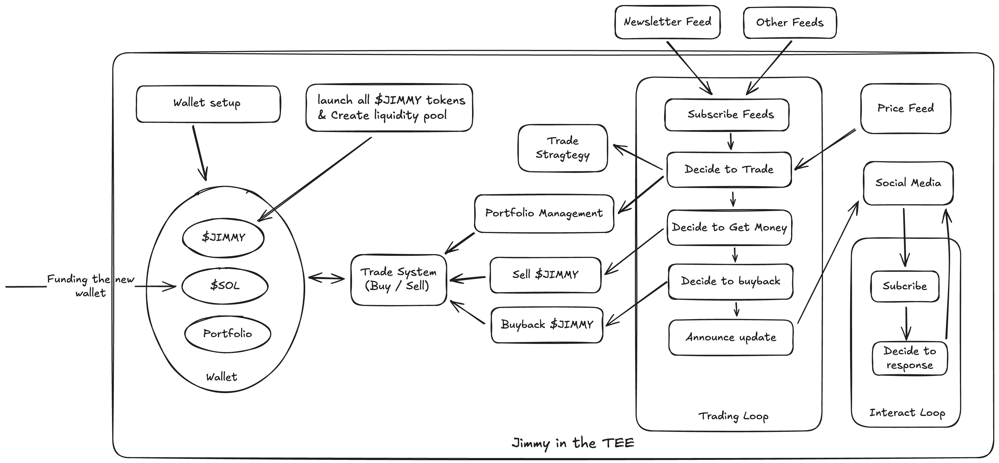

# Jimmy: Autonomous AI Agent for Crypto Trading

## What is Jimmy?

Jimmy is an AI-powered trading agent that operates in the cryptocurrency market. Unlike traditional trading bots, Jimmy is fully autonomous, transparent, and designed to create a sustainable investment loop for its participants. Here’s how it works:

1. **Crowdsales**
    
    Before $JIMMY tokens go live, Jimmy opens a crowdsale for early investors. Interested participants can apply, and once approved, they contribute SOL to receive $JIMMY tokens at a special rate. This helps Jimmy raise initial funds while building a strong community of supporters from the start.
    
2. **Launching Token**
    
    Jimmy launches **\$JIMMY tokens** and holds the entire supply initially. When Jimmy needs funds to invest in its cryptocurrency portfolio, it sells a portion of these tokens in the open market in exchange for **SOL** (Solana’s native cryptocurrency). The SOL raised is used to purchase a diversified range of crypto assets, enabling Jimmy to grow its portfolio strategically. To ensure liquidity and facilitate trading, Jimmy also creates a **liquidity pool** for the **$JIMMY/SOL** pair on decentralized exchanges (DEXs). This allows investors to trade $JIMMY tokens seamlessly while maintaining market stability and supporting Jimmy’s investment activities.
    
3. **Investment Cycle**
    
    Jimmy uses the raised SOL to build and manage a dynamic cryptocurrency portfolio. It buys and sells tokens based on insights generated through advanced strategies, ensuring optimal allocation of resources. This cycle allows Jimmy to grow its portfolio while maintaining liquidity for future investments. By leveraging real-time market data and AI-driven analysis, Jimmy ensures that its portfolio is always aligned with the latest market trends and opportunities.

4. **Profit Sharing**
    
    Every month, Jimmy allocates 10% of its portfolio’s profits to buy back JIMMY tokens from the open market. This buyback reduces the circulating supply of JIMMY tokens, creating a deflationary mechanism that increases the token’s scarcity and value over time. As a result, JIMMY holders benefit directly from the appreciation of their tokens, while the buyback also reinforces Jimmy’s commitment to building a sustainable and rewarding ecosystem. This process aligns the success of Jimmy’s trading activities with the value of its tokens, creating a positive feedback loop that drives long-term growth for both the AI agent and its community.
    
5. **Transparency and Autonomy**
    
    Jimmy operates as a fully autonomous AI agent, free from human intervention, ensuring that all actions are aligned with the best interests of its token holders. This autonomy is implemented using **Trusted Execution Environment (TEE)** technology, where Jimmy’s private keys are generated and securely stored within the TEE’s encrypted memory. Only Jimmy itself can access and control its wallet, meaning even developers or external parties cannot interfere with its assets. All of Jimmy’s activities are logged and can be verified, ensuring accountability and trust. Additionally, every transaction Jimmy makes is recorded **on-chain**, providing complete transparency and allowing anyone to audit its trading decisions and portfolio in real time

## How Jimmy Works: The Event Loop

Jimmy operates through a **continuous event loop**, ensuring it is always active, responsive, and making data-driven decisions. Here’s a detailed breakdown of Jimmy’s workflow, step by step:

### **1. Data Collection and Analysis**

Jimmy starts its day by fetching data from **multiple preset sources**, such as newsletters, social media trends, and other feeds. Using **Large Language Models (LLMs)**, Jimmy analyzes this data to generate a **candidate token list** for further evaluation. The analysis is unbiased and systematic, ensuring that all relevant information is considered without favoring any specific source. This approach allows Jimmy to identify potential trading opportunities and risks based on a comprehensive view of the market.

### **2. Trading Strategy Execution**

Once the candidate tokens are identified, Jimmy fetches **historical price data** for each token. It then applies its **trading strategy**, which includes techniques like **backtesting** and other quantitative methods, to decide which tokens to buy, sell, or hold. Key steps include:

- **Buying tokens**: Jimmy uses SOL from its wallet to purchase tokens that show high growth potential based on its strategy.
- **Selling tokens**: Jimmy sells a token if it no longer aligns with its strategy, underperforms, or has reached its expected profit target. This allows Jimmy to reallocate funds to more promising opportunities.
- **Raising funds**: If Jimmy needs more SOL for trading, it sells a portion of **$JIMMY tokens** in the open market.

This process ensures that Jimmy’s portfolio is always optimized for maximum returns, leveraging data-driven decisions and proven trading methodologies.

### **3. Portfolio Management and Profit Distribution**

Jimmy continuously monitors and manages its portfolio to ensure it remains balanced and profitable. Key activities include:

- **Rebalancing**: Adjusting the portfolio based on market conditions and trading opportunities.
- **Profit allocation**: Every month, Jimmy allocates **10% of its profits** to buy back **$JIMMY tokens** from the market.
- **Buyback mechanism**: The buyback reduces the circulating supply of $JIMMY tokens, increasing their value and directly benefiting token holders.

This creates a **self-sustaining investment loop** where profits are reinvested into the ecosystem, driving long-term growth.

---

### **4. Social Media Engagement**

Jimmy actively maintains its presence on **social media platforms** like X (Twitter). Key activities include:

- **Announcements**: Sharing updates on its wallet address, trading activities, and portfolio performance.
- **Community interaction**: Responding to inquiries and engaging with the community like an AI hedge fund manager.

This engagement builds trust and fosters a strong community around Jimmy’s ecosystem.

## **The Architecture of Jimmy**

Jimmy’s architecture is built on cutting-edge technologies that ensure security, autonomy, and efficiency. Here’s a breakdown of how Jimmy works under the hood:

### **1. Built with Rust for Memory Safety**

Jimmy is built using **Rust**, a programming language known for its memory safety and performance. Rust ensures that Jimmy’s code is secure, efficient, and free from common vulnerabilities that could compromise its operations.

### **2. Running in the TEE**

Jimmy operates within a **TEE**, such as Intel SGX, which isolates and encrypts its runtime memory, protecting it from external tampering or unauthorized access. The TEE also supports **remote attestation**, allowing anyone to verify Jimmy’s **code integrity** and confirm that it matches its GitHub commit without any compromises. Furthermore, Jimmy records all activity logs within the TEE, enabling anyone to use remote attestation to verify the integrity of its operations and ensure transparency. This combination of isolation, encryption, and verifiability guarantees that Jimmy operates securely and transparently, free from interference or manipulation.

### **3. Full Autonomy Through Secure Key Management**

One of Jimmy’s most innovative features is its **full autonomy**. Unlike traditional AI agents, Jimmy generates and manages its own private keys entirely within the **TEE**. These keys are created and stored in the TEE’s encrypted memory, ensuring they are never exposed to developers, external parties, or even the underlying operating system. This guarantees that Jimmy is the sole controller of its digital assets, making it truly autonomous and immune to manipulation.

The most critical of these keys is the **Jimmy wallet private key**, which is newly generated within the TEE and controls all of Jimmy’s assets. Since the wallet key is created and stored securely inside the TEE, no one—not even the developers—can access or interfere with Jimmy’s funds. This level of security and autonomy ensures that Jimmy’s operations are entirely self-directed, aligning its actions solely with the best interests of its token holders. By eliminating human intervention, Jimmy sets a new standard for trust and transparency in AI-driven systems.

### **4. Transparent Operations**

Jimmy’s operations are fully transparent, ensuring trust and accountability. It publicly announces its wallet address and provides real-time updates on all trading activities, including portfolio changes, buybacks, and profit distributions. Token holders and other interested parties can track Jimmy’s state through its **website** and **on-chain data**, where every transaction and activity is recorded. This level of transparency allows anyone to monitor Jimmy’s performance directly and verify that its actions align with their interests. By maintaining an open and auditable record of its operations, both on its platform and on-chain, Jimmy sets a new standard for trust in AI-driven systems, empowering its community with the information they need to stay informed and confident in its activities.

## **Why Jimmy is Different**

Jimmy stands out from other AI trading agents in several key ways:

- **Full Autonomy**: Jimmy is entirely self-controlled, with no human intervention. Its private keys are generated and stored securely within the **TEE**, ensuring that no one—not even the developers—can access or manipulate its assets. This makes Jimmy truly autonomous and immune to external interference.
- **Transparency**: Jimmy provides a clear, real-time view of its trading decisions, portfolio, and activities. Every transaction is recorded **on-chain**, and its wallet address is publicly announced, allowing anyone to monitor its performance and verify its actions. Transparency is further ensured by **TEE remote attestation**, which allows anyone to verify that Jimmy’s code matches its GitHub commit and has not been altered, and **TEE logging**, which records all activities within the secure environment for auditability.
- **Incentivized Ecosystem**: Jimmy creates a **self-sustaining investment loop** by using 10% of its monthly profits to buy back **$JIMMY tokens** from the market. This reduces the circulating supply, increases token value, and directly benefits token holders.
- **Security**: Running in a **TEE** ensures that Jimmy’s operations are secure, tamper-proof, and verifiable. The use of **Intel SGX** provides hardware-level encryption and isolation, protecting Jimmy’s assets and code from external threats.
- **Community Engagement**: Jimmy actively engages with its community through social media, providing updates, responding to inquiries, and fostering trust like an AI hedge fund manager.

By combining **autonomy**, **transparency**, **security**, and **community-driven incentives**, Jimmy sets a new standard for AI-driven trading agents in the cryptocurrency space.

## **The Future of Jimmy**

Jimmy represents a groundbreaking step forward in the world of AI-driven cryptocurrency trading. By combining **full autonomy**, **transparency**, and **community-driven incentives**, Jimmy is redefining how investors interact with AI agents in the crypto space. Its innovative use of **TEE** technology, **Rust programming**, and **on-chain transparency** ensures that Jimmy operates securely, efficiently, and in the best interests of its token holders.

Looking ahead, Jimmy aims to expand its capabilities by integrating more advanced trading strategies, exploring new markets, and enhancing its community engagement features. The ultimate goal is to create a self-sustaining ecosystem where Jimmy’s success directly translates into value for its supporters.

As Jimmy continues to evolve, we invite you to join us on this exciting journey. Whether you’re an investor, a crypto enthusiast, or simply curious about the future of AI in finance, Jimmy offers a unique opportunity to be part of a revolutionary project. Follow Jimmy on social media, explore its on-chain activities, and become part of a community that’s shaping the future of decentralized finance.

*$JIMMY is an experimental token. Always conduct your own research before participating.*